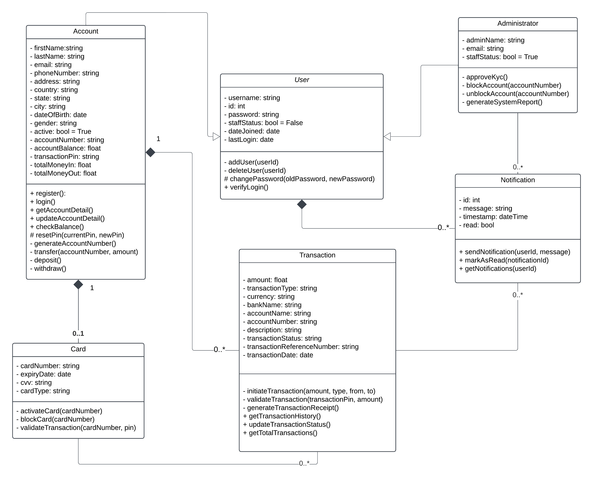
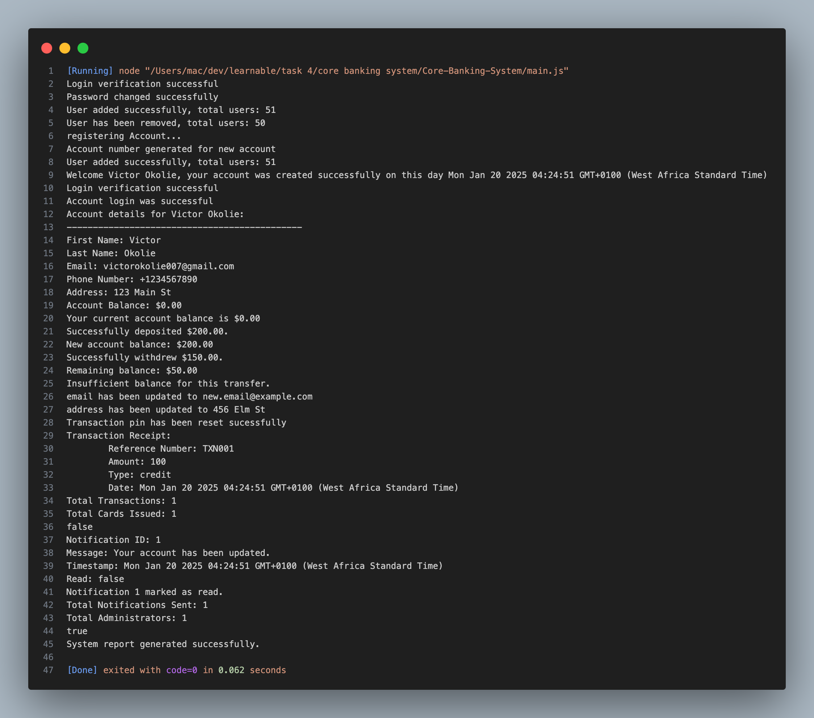

# Core-Banking-System
This is a simplified UML overview that models a banking application system where customers manage accounts, perform deposits, withdrawals and other transactions, offering a clear visualization of core banking processes through UML diagrams 

---

## Features
### User Management
- User authentication with `username` and `password`.
- Password reset functionality.
- User login verification.

### Account Management
- Manage personal details (e.g., name, email, address).
- View and update account details.
- Deposit, withdraw, and transfer money.

### Transaction Management
- Track all transactions with details like amount, type, and status.
- Generate transaction receipts.
- Retrieve transaction history.

### Card Management
- Issue and manage cards (debit/credit).
- Validate and block cards.

### Notification System
- Send and manage notifications.
- Mark notifications as read.
- Filter unread notifications.

### Administrative Control
- Approve or block user accounts.
- Generate system reports.
- Manage KYC verification.

---

## UML Diagram
Here is the UML diagram representing the design of this system:

### Diagram Image

### Lucidchart Link
[View the UML Diagram on Lucidchart](https://lucid.app/lucidchart/305643b6-c60b-4cfc-bb11-e8bb3a94667c/edit?viewport_loc=-169%2C-447%2C1579%2C899%2C0_0&invitationId=inv_f0f8122e-8084-4a84-803c-0506f3184aa4)

---

## Code Execution Output
Below is a screenshot of the program execution:

---